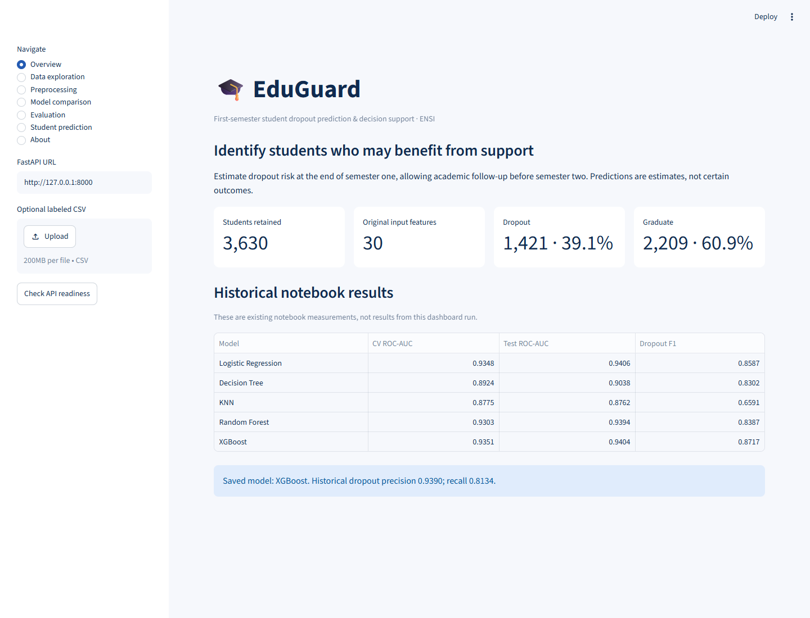
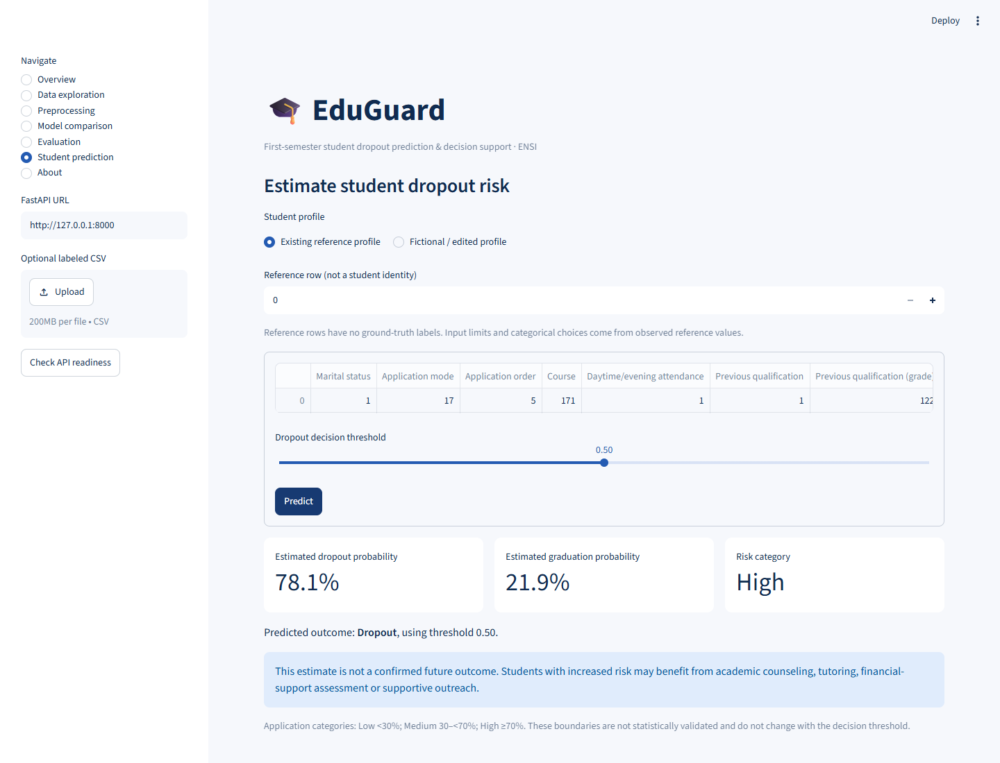

# EduGuard

Predict student dropout risk at the end of the first semester.

**3,630 students · 30 features · Dropout=0, Graduate=1.** Enrolled students and second-semester variables are excluded.

## Run locally

Python 3.12 or 3.13. For a fresh clone:

```powershell
python -m venv .venv
.\.venv\Scripts\python.exe -m pip install -r requirements.txt
```

Double-click **start_eduguard.bat**, then open [localhost:8501](http://localhost:8501).

To try the saved model: **Check API readiness → Student prediction → select a profile → Predict**. No retraining is needed.

API documentation: [localhost:8000/docs](http://localhost:8000/docs). Use **Try it out** to test a prediction in the browser.

## Project

- **app.py** — Streamlit dashboard.
- **api.py** — FastAPI prediction service.
- **ml_utils.py** — preprocessing, training and evaluation.
- **preprocessing.pkl + xgboost_model.json** — existing trained model.
- **reference.csv** — example student profiles without outcome labels.
- **prj1-datamining.ipynb** — original training notebook.
- **[ONE_PAGER.pdf](ONE_PAGER.pdf)** — project summary.

The labeled dataset loads automatically from [UCI](https://archive.ics.uci.edu/dataset/697/predict+students+dropout+and+academic+success). You can also upload a CSV.

Five algorithms are available: Logistic Regression, Decision Tree, KNN, Random Forest and XGBoost. Training runs only when requested; preprocessing stays inside pipelines. Select thresholds using training validation results before inspecting the held-out test.

Saved XGBoost results from the notebook: **ROC-AUC .9404 · Dropout F1 .8717 · Precision .9390 · Recall .8134**.

Predictions support student follow-up, not automatic decisions. Risk bands: Low <30%, Medium 30–<70%, High >=70%; these bands are application-defined.

## Screenshots





## Test and deploy

Tests: `.\.venv\Scripts\python.exe -m pytest -q`.

For deployment, run FastAPI on a backend server and Streamlit on Community Cloud. Set **EDUGUARD_API_URL** to the backend's public HTTPS URL. Online deployment is pending.
